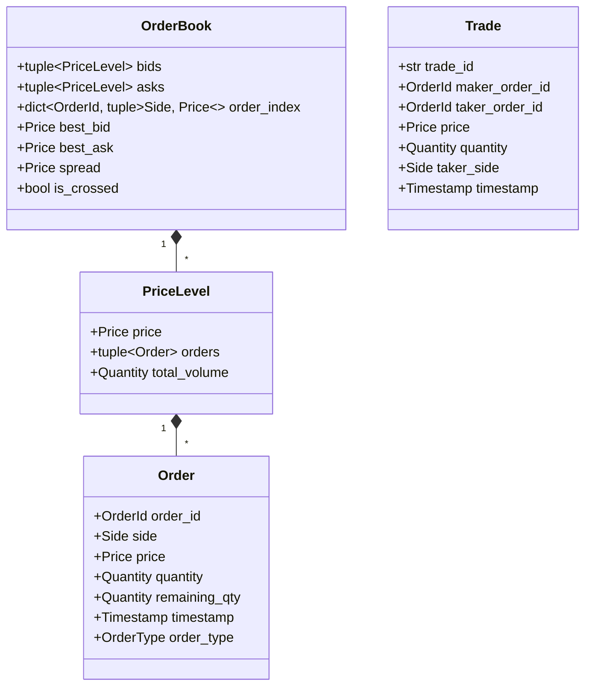

# LOB — Limit Order Book & Matching Engine

[](https://www.python.org/downloads/)
[](https://mypy.readthedocs.io/)
[](https://hypothesis.readthedocs.io/)
[](LICENSE)

This project is a small Python implementation of a limit order book and matching engine for learning and experimentation. It focuses on the core mechanics of matching, price-time priority, partial fills, cancellations, and replaying order streams in a compact, immutable design.

The goal is to explore how a simple trading engine behaves in Python without aiming to be production-grade exchange infrastructure.

---

## Key Features

- **Immutable book state**: Order and book updates are represented as value objects rather than in-place mutation.
- **Price-time priority (FIFO)**: Orders are queued by arrival time within each price level.
- **Order types**:
  - `LIMIT`: Adds or matches resting liquidity as available.
  - `MARKET`: Sweeps the book immediately and cancels any remainder.
  - `CANCEL`: Removes an existing order by `order_id`.
- **Partial fills**: Orders can execute against multiple price levels and remaining quantities.
- **Replay CLI**: A small command-line interface for processing CSV order events into trades and snapshots.
- **Invariant-style checks**: The tests exercise expected book behavior and matching rules.
- **Type hints and structured code**: The implementation uses explicit Python types to keep behavior easier to reason about.

---

## Domain Model & State Hierarchy

All core models are immutable value objects:



---

## Invariant-Style Checks

The tests are organized around a few core expectations that matter for a matching engine:

1. **No crossed book**: the best bid should not exceed the best ask in a valid state.
2. **Basic quantity accounting**: trades and cancellations should be consistent with the volume that enters and leaves the book.
3. **Price-time priority**: within the same price level, earlier orders are matched first.
4. **Replay consistency**: processing the same order sequence should produce the same results.

These checks help validate the behavior of the engine during development, but this project is still best viewed as a learning implementation rather than a production-grade exchange system.

---

## Getting Started

### Installation & Virtual Environment

```bash
# Clone or navigate to project directory
cd lob

# Create virtual environment and activate
python -m venv .venv
# Windows:
.\.venv\Scripts\activate
# Linux/macOS:
source .venv/bin/activate

# Install dependencies and package in editable mode
pip install -e .
pip install -r requirements.txt
```

---

## Usage

### 1. Replay CLI

Run a deterministic replay of orders from a CSV file:

```bash
# Basic replay with sample input
python -m lob.cli replay -i sample_orders.csv -t trades.csv -s snapshot.txt
```

#### Input CSV Format (`orders.csv`):
```csv
timestamp,action,order_id,side,price,quantity
1,LIMIT,O1,BUY,100.00,100
2,LIMIT,O2,BUY,99.50,50
3,LIMIT,O3,SELL,101.00,200
4,MARKET,O4,SELL,0,40
5,CANCEL,O2,BUY,0,0
```

#### Output Trades Format (`trades.csv`):
```csv
timestamp,trade_id,maker_order_id,taker_order_id,taker_side,price,quantity
4,T-O4-1,O1,O4,SELL,100.00,40
```

### 2. Python API

```python
from lob import empty_book, process_order, Order, Side, OrderType, MatchResult

# Initialize empty book
book = empty_book()

# Create limit buy order ($100.00 = 10000 ticks)
order = Order(
    order_id="O1",
    side=Side.BUY,
    price=10000,
    quantity=50,
    remaining_qty=50,
    timestamp=1001,
    order_type=OrderType.LIMIT
)

# Process order (returns new book and trade records)
result = process_order(book, order)
new_book = result.book
print(f"Best Bid: {new_book.best_bid}, Total Bid Vol: {new_book.total_bid_volume}")
```

---

## Testing & Static Analysis

Run the full test suite (unit + Hypothesis property-based invariant tests):

```bash
pytest -v
```

Run MyPy strict static type checker:

```bash
mypy lob tests benchmarks
```

---

## Benchmarking & Performance Notes

This project includes a simple benchmark script for rough throughput and latency measurements.

```bash
python benchmarks/benchmark.py
```

### Example results from a local run

| Metric | Measured Value |
| :--- | :--- |
| **Throughput** | **~31,150 orders / sec** |
| **Mean Latency** | `27.60 µs` |
| **p50 Latency (Median)** | `19.20 µs` |
| **p90 Latency** | `72.90 µs` |
| **p99 Latency** | `108.70 µs` |
| **p99.9 Latency** | `172.10 µs` |
| **Max Latency** | `999.70 µs` |

---

## What Limits Python's Speed Here & How to Go Faster

### 1. What Limits Python's Performance?

1. **Object Allocation Overhead (GC Pressure)**:
   - In pure functional style, every order placement, partial fill, or cancellation creates new `Order`, `PriceLevel`, and `OrderBook` instances (via `dataclasses.replace` and tuple slicing).
   - Python memory allocation for small objects creates noticeable pressure on CPython's reference counting and generational garbage collector.
2. **Pointer Chasing & CPU Cache Invalidation**:
   - Immutable nested structures (`OrderBook` $\rightarrow$ `tuple[PriceLevel]` $\rightarrow$ `tuple[Order]`) scatter pointers across Python heap memory.
   - This prevents CPU hardware prefetchers from effectively using L1/L2 data caches, leading to frequent CPU cache misses.
3. **Dynamic Dispatch & Bytecode Interpreter**:
   - Every attribute lookup, method call, and dictionary key check incurs dynamic type checking and CPython bytecode dispatch overhead.

### 2. How to Achieve High-Frequency (HFT) Speeds (10M+ ops/sec)?

To transition from ~30k ops/sec in pure Python to multi-million ops/sec performance required in production HFT matching engines, the following changes would be implemented:

1. **Native Compiled Extension (Rust / C++ via PyO3 / CFFI)**:
   - Move the inner matching loop into Rust or C++. Python serves only as a high-level API orchestrator.
2. **Pre-allocated Flat Memory Slabs (Zero-Allocation Core)**:
   - Use a pre-allocated fixed-size array (arena/slab allocator) of C-structs for orders and price levels.
   - Eliminates heap allocation during order matching.
3. **Intrusive Doubly-Linked Lists & B-Trees**:
   - Maintain price levels using an array-backed B-Tree or radix tree.
   - Maintain order queues using intrusive doubly-linked lists inside pre-allocated slab memory for $O(1)$ order insertion, matching, and cancellation.
4. **Fixed-Point Integer Arithmetic**:
   - Use 64-bit unsigned integers (`uint64_t`) for price ticks and quantities, eliminating object wrappers or floating point overhead.
5. **Lockless Single-Producer Single-Consumer Queues (Disruptor Pattern)**:
   - Use ring-buffer IPC for thread-safe event ingestion without mutex contention.

---

## Design Decisions & Limitations

### Design Decisions
- **Fixed-Point Prices**: Prices are integer ticks (e.g., $100.50 \rightarrow 10050$), avoiding floating-point rounding errors.
- **Pure Functions**: `process_order` returns `MatchResult` or `CancelResult` without altering the input `OrderBook`. This enables time-travel debugging, parallel simulation branching, and simple state snapshotting.
- **Explicit Indexing**: `OrderBook.order_index` maps `order_id` to `(side, price)` for fast $O(N_{\text{levels}})$ order cancellation rather than scanning every price level.

### Limitations
- **Memory Footprint under Functional Copying**: Replaying millions of orders in memory keeps previous book states alive if referenced by callers.
- **Single Threaded**: Matching logic is single-threaded by design to preserve price-time priority determinism.

---

## License

This project is licensed under the [MIT License](LICENSE).
